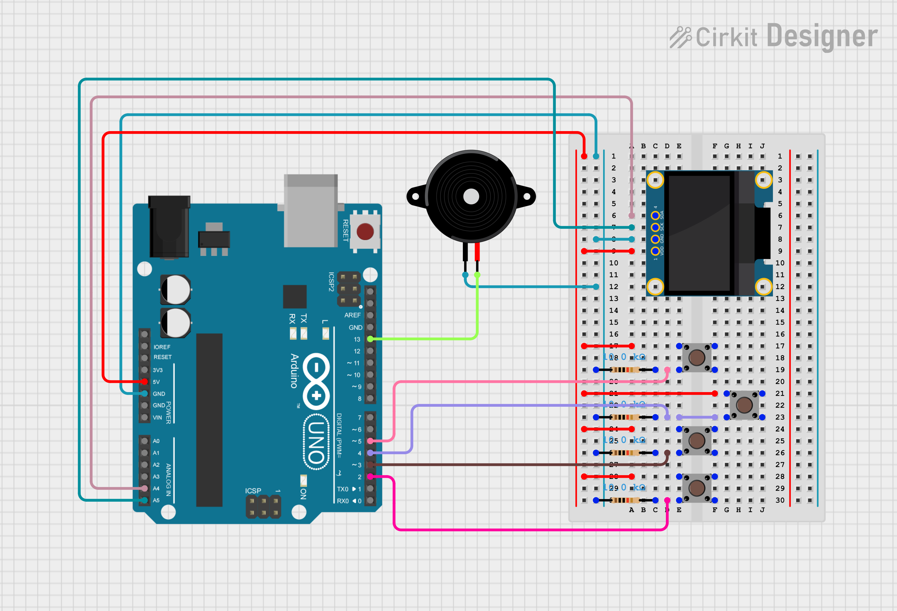

# Tetris for Arduino

**Introduction**:
This repository contains my first complete project involving microcontroller programming.
It implements a fully playable version of the classic game Tetris, designed for Arduino-compatible boards.
The project is also intended as a portfolio showcase and is released as open-source software for anyone interested in contributing or extending its functionality.

## Hardware Requirements
To run the project, you will need:
- Arduino UNO R3 *(Arduino Nano is also supported)*
- 128×64 I2C OLED display *(mounted vertically)*
- 4 momentary push buttons
- 1 piezo buzzer

**Wiring** 
*OLED Display (I2C)*
| OLED Pin | Arduino Pin |
|----------|-------------|
| VDD      | 5V          |
| GND      | GND         |
| SCL      | A5          |
| SDA      | A4          |

**Input Buttons**
| Function | Arduino Pin | Mode  |
|----------|-------------|-------|
| DOWN     | 2           | INPUT |
| LEFT     | 3           | INPUT |
| RIGHT    | 4           | INPUT |
| ROTATION | 5           | INPUT |

**Output**
| Component    | Arduino Pin | Mode   |
|--------------|-------------|--------|
| Piezo Buzzer | 13          | OUTPUT |

    

## System Overview
**Display Layout** 
The OLED display is rotated 90° to provide additional vertical space, more closely matching the proportions of the original Tetris playfield.

Each block measures 6×6 pixels 
Usable screen area: 120×60 pixels (from the original 128×64, after subtracting margins) 

Grid size: 20 rows × 10 columns 
The grid is represented by a two-dimensional array: `int game_map[20][10]` 
Each cell stores: 
0 → empty block 
1 → filled block (used for rendering and collision detection)

## Tetromino Representation
Each tetromino consists of 4 blocks, each defined by its x/y coordinates. 
Their rotation states are stored in a structured array: 
`int tetromino[rotation][8]`; 
Every rotation contains 8 integers (4 blocks × 2 coordinates). 
A dedicated struct stores the currently active tetromino and its rotation index.

## Coordinate System
**Pixel and Grid Mapping**
The playfield area (120×60) includes:
- 4-pixel margins (top and bottom)
- 2-pixel margins (left and right) 
With these margins, the playfield’s top-left corner starts at (1, 3) in pixel coordinates, for a total container size of 122×62 pixels.

Tetrominoes spawn at:
`x = 2, y = 4` (in pixel space) 
The conversion from grid coordinates to pixel coordinates is: 
`pixel_x = left_margin + (column * block_size)` 
`pixel_y = top_margin  + (row    * block_size)`

*Example:*
A block located at game_map[18][4] will be drawn starting at: 
`pixel_x = 2 + (4 * 6)` 
`pixel_y = 4 + (18 * 6)` 
*Pixel coordinates are used only for drawing. All gameplay logic—movement, rotation, collision detection—uses grid coordinates.*

## Game Mechanics
Tetrominoes automatically move downward every 1000 ms. 
Movement updates operate on grid coordinates. 
Collision with placed blocks or the bottom boundary locks the current tetromino and set 1 in game_map where blocks are in place. 
Full rows are cleared and the score updated. 
A new tetromino is generated when the previous one locks in place.

## Contributing
Contributions are welcome. 
Feel free to submit pull requests for:
- Code improvements
- New features
- Performance optimizations
- Bug fixes

## License
This project is open source and distributed under the terms of the license included in the repository.